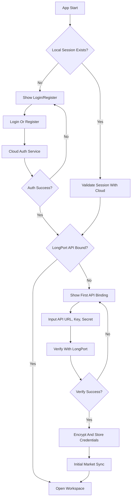
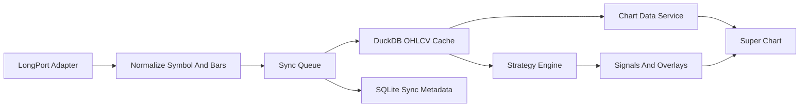
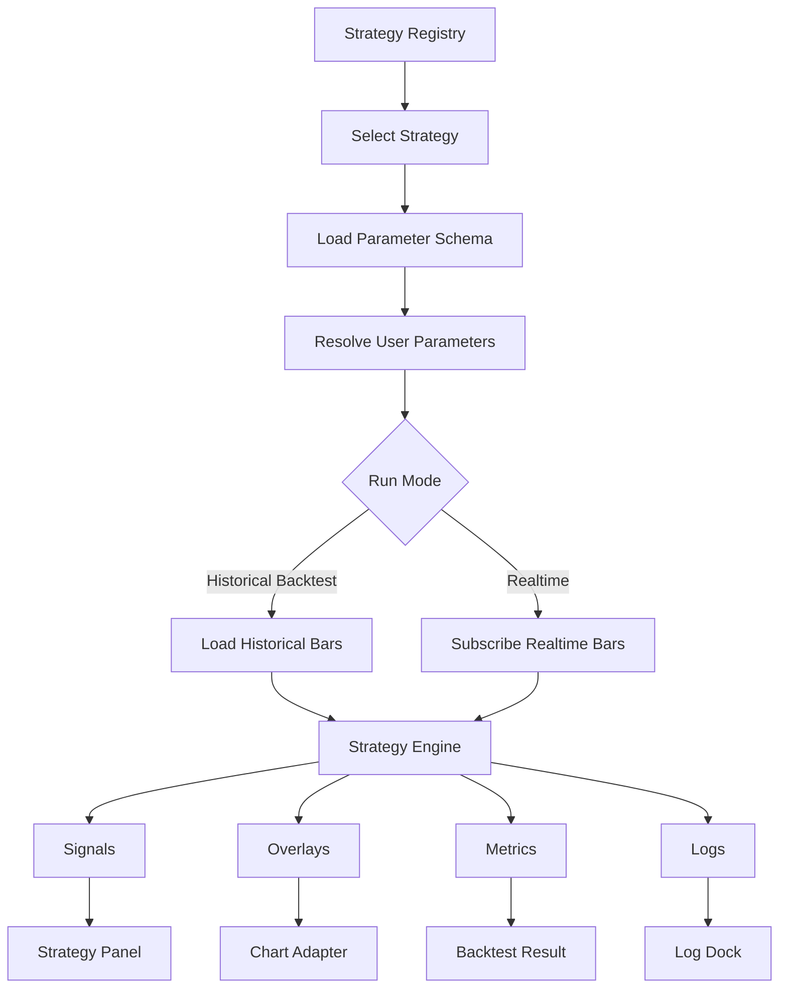
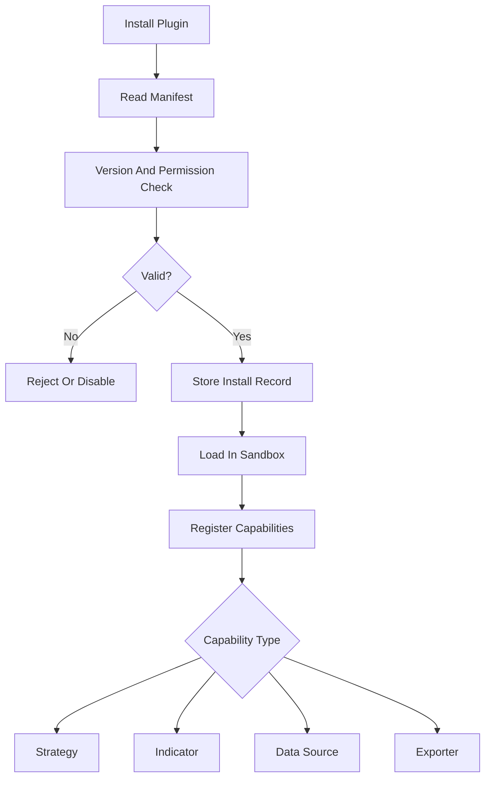

# Quant Learning Desktop System Architecture

## 1. Product Positioning

The system is a professional desktop quant learning and strategy research platform.

Target positioning:

- TradingView-like charting workstation.
- Quant strategy learning platform.
- Pine Script strategy research and conversion workspace.
- Local-first desktop app for US, HK, and A-share market learners.

Primary users:

- Stock trading learners.
- Pine Script strategy researchers.
- US, HK, and A-share market users.
- Users who need chart study, strategy explanation, backtesting, and simulated signals.

The first visual target is **TradingView Pro Workbench**:

- Dark professional chart workspace.
- Dense but readable panels.
- Central super chart.
- Left drawing toolbar.
- Right watchlist and market detail panel.
- Bottom strategy, backtest, orders, logs, and console dock.

## 2. Architecture Overview

The system uses a desktop shell, a React workbench, a local service layer, local persistence, and remote verification services.

```text
------------------------------+
| Electron Desktop Shell       |
| - Window management          |
| - Secure preload bridge      |
| - Local process supervision  |
+---------------+--------------+
                |
                v
+------------------------------+
| React Workbench              |
| - Chart workspace            |
| - Strategy panels            |
| - Learning pages             |
| - Settings and plugin UI     |
+---------------+--------------+
                |
                v
+------------------------------+
| Local API Service            |
| - Auth session facade        |
| - LongPort adapter facade    |
| - Market data sync           |
| - Strategy orchestration     |
| - Plugin loading             |
+---------------+--------------+
                |
     +----------+----------+
     |                     |
     v                     v
+------------+      +----------------+
| SQLite     |      | DuckDB         |
| Metadata   |      | OHLCV/backtest |
+------------+      +----------------+
     |
     v
+------------------------------+
| File Cache                   |
| - Plugin packages            |
| - Export files               |
| - Logs and snapshots         |
+------------------------------+

Remote services:
  - Cloud auth service
  - Invite code verification
  - Email verification
  - LongPort OpenAPI
  - Future broker/data providers
```

## 3. Technology Stack

### Desktop Framework

Recommended: **Electron**

Reasons:

- Best fit for a TradingView-like charting workstation.
- Strong compatibility with React, Monaco Editor, chart libraries, and plugin-like web UI.
- Mature multi-window, menu, tray, and desktop packaging ecosystem.
- Lower implementation risk for a complex TypeScript monorepo.

Alternatives:

- Tauri: lighter and security-focused, but Rust bridge and ecosystem complexity are higher for this project.
- Flutter Desktop: strong UI consistency, but weaker integration with TradingView-style web charting and TypeScript strategy tooling.

### Frontend

Recommended: **React + TypeScript**

Reasons:

- Strong ecosystem for charts, editors, state, tables, and desktop-like workspaces.
- Good compatibility with Lightweight Charts and TradingView Charting Library.
- Mature component ecosystem.
- Type sharing with local Node services and strategy packages.

### UI System

Recommended: **shadcn/ui + Radix + Tailwind + lucide-react**

Reasons:

- Good control over a dense professional workstation UI.
- Avoids heavy enterprise-admin visual defaults.
- Radix gives accessible primitives.
- Tailwind allows fast iteration on dark themes and layout density.

### Charting

Recommended initial chart engine: **Lightweight Charts**

Reasons:

- Built by TradingView.
- Lightweight and suitable for first implementation.
- Supports candlesticks, volume, crosshair, time scale, price scale, and overlays.
- Can be wrapped behind a chart adapter to preserve future migration options.

Future target: **TradingView Charting Library**

Use when licensing and integration requirements are confirmed.

ECharts role:

- Dashboard metrics.
- Backtest equity curves.
- Distribution and comparison charts.
- Not the primary candlestick engine.

### State Management

Recommended: **Zustand + TanStack Query**

Responsibilities:

- Zustand: workspace layout, selected symbol, selected strategy, UI panels, theme, local session state.
- TanStack Query: API request lifecycle, stale data, refetching, remote/local service caching.

### Persistence

Recommended local persistence:

- SQLite for structured metadata.
- DuckDB for historical OHLCV, backtest tables, and analytical queries.
- File cache for plugins, exports, snapshots, and archived logs.

Cloud persistence:

- Postgres for users, invite codes, email verification, auth, and audit records.

### Local Backend

Recommended: **Node.js with NestJS-style modular architecture**

Reasons:

- Same language as frontend and strategy packages.
- Strong TypeScript sharing.
- Good fit for local API modules, task queues, plugins, and SDK adapters.
- Lower early-stage complexity than a multi-language stack.

Go or Rust can be introduced later for performance-sensitive native extensions.

## 4. Monorepo Structure

```text
project/
  apps/
    desktop/
      # Electron main process, preload bridge, window lifecycle.
    web/
      # React workbench UI.
    local-server/
      # Local API, sync jobs, strategy orchestration, plugin host.
    cloud-server/
      # Auth, invite codes, email verification, cloud audit.
  packages/
    ui/
      # Shared UI components.
    shared/
      # Shared types, constants, enums, error codes.
    api-client/
      # Frontend client for local/cloud APIs.
    chart/
      # Chart adapter, overlays, drawing tool contracts.
    strategy-engine/
      # Strategy interface, runtime context, backtest engine.
    preset-strategies/
      # Built-in strategies converted from Pine Script.
    pine-runtime/
      # Pine-compatible helper functions and time-series utilities.
    plugin-sdk/
      # Plugin manifest, lifecycle, capabilities, permissions.
    data-adapters/
      # LongPort and future broker/data source adapters.
    persistence/
      # SQLite/DuckDB schema, migrations, repositories.
  docs/
    architecture.md
    database.md
    ui-design.md
    plugin-system.md
    strategy-system.md
    execution-plan.md
  trading-strategies/
    # Original Pine Script source files.
  data/
    samples/
  scripts/
  tests/
```

## 5. Module Boundaries

### UI Workbench

Owns:

- Layout.
- Navigation.
- Chart presentation.
- Forms and panels.
- User interactions.

Does not own:

- Trading SDK calls.
- Strategy calculations.
- Database access.
- Plugin execution.

### Local API Service

Owns:

- Local HTTP or IPC API.
- Auth session facade.
- API binding verification orchestration.
- Market data sync.
- Strategy runtime orchestration.
- Plugin lifecycle.
- Repository access.

### Data Adapter Layer

Owns:

- LongPort SDK integration.
- Future broker/data source adapters.
- Symbol normalization.
- Error mapping.
- Rate-limit handling.

### Strategy Engine

Owns:

- Strategy contracts.
- Time-series helpers.
- Backtest loop.
- Real-time bar update loop.
- Signal and overlay outputs.

Does not own:

- UI rendering.
- Broker SDK.
- Desktop lifecycle.

### Chart Package

Owns:

- Chart adapter interface.
- Lightweight Charts integration.
- Overlay rendering contracts.
- Drawing tool data model.

Does not own:

- Strategy calculations.
- Market sync.

### Plugin System

Owns:

- Plugin manifest.
- Installation record.
- Capability registration.
- Version checks.
- Permission declarations.
- Runtime isolation strategy.

## 6. Login And API Binding Flow



## 7. Market Data Flow



## 8. Strategy Runtime Flow



## 9. Plugin Runtime Flow



## 10. Data Sync Strategy

The system should support local-first usage with explicit online verification for auth and API binding.

Sync categories:

- Auth/session: cloud verified.
- API binding: cloud/local workflow plus LongPort verification.
- Market list: fetched and cached.
- Watchlist: synced from LongPort when available and stored locally.
- Historical K-line: cached in DuckDB by symbol, timeframe, adjustment mode, and market.
- Strategy results: local by default.
- Learning progress: local first; cloud sync can be added later.

Cache policy:

- SQLite records data freshness, sync cursor, and error status.
- DuckDB stores analytical time-series data.
- File cache stores large plugin files, exports, and snapshots.

## 11. Security Principles

- API Secret is never stored in frontend state.
- Credentials are stored encrypted using OS-level secure storage when available.
- Logs must redact API keys, secrets, tokens, and email verification codes.
- Renderer process uses a narrow preload bridge.
- Remote content should not run inside privileged contexts.
- Plugins declare permissions and run with restricted capabilities.

## 12. Initial Non-Goals

- No real-money order execution in the first implementation.
- No full Pine Script compiler in the first implementation.
- No cloud collaboration in the first implementation.
- No large market data committed to Git.
- No speculative AI module before core chart and strategy workflows are stable.
