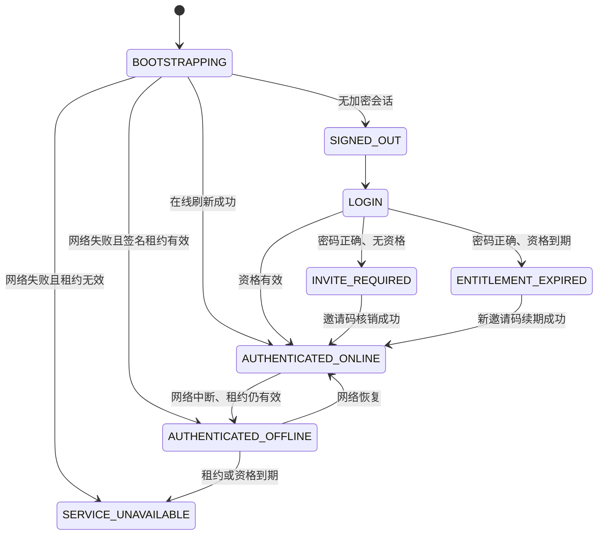

# 云端认证与桌面授权架构

## 边界

- `apps/cloud-server`：Fastify 认证 API、PostgreSQL 仓储、SMTP outbox 和邀请码 CLI。
- `packages/shared/src/auth.ts`：云端、主进程和 Renderer 共用的非敏感契约。
- `packages/api-client/src/auth.ts`：HTTPS 传输、稳定错误码和网络错误归一化。
- `apps/desktop/src/electron/auth*`：令牌、登录挑战、离线租约、设备身份和 IPC。
- `apps/desktop/src/features/auth`：Renderer 状态机、本机账号绑定和 UI 辅助规则。

Renderer 不接收刷新令牌、访问令牌、离线租约或云端登录挑战。访问令牌只存在于 Electron 主进程内存；刷新令牌和离线租约经 `safeStorage` 加密后保存到 `auth-session.enc`。

## 认证状态



## 邀请码

邀请码采用 `QLD-XXXXX-XXXXX-XXXXX` 格式。生成时不绑定账号，数据库只保存带 pepper 的 HMAC-SHA-256 摘要。兑换事务通过 `SELECT ... FOR UPDATE` 锁定邀请码记录，再更新资格、永久核销邀请码并写入兑换审计；并发请求只有一个可以成功。

续期基准：

- 没有资格或资格已经到期：从兑换时刻开始计算。
- 资格仍有效：从原到期时间顺延。

批次最多 500 枚，支持 7、30、90、365 天。明文 CSV 权限为 `600`，输出不打印邀请码内容，超过 24 小时由 tmpfiles 和 CLI 启动清理双重回收。

## 会话和离线授权

- 访问令牌：15 分钟，只保存在主进程内存。
- 刷新令牌：30 天，轮换使用，`safeStorage` 加密保存。
- 活跃设备：最多 2 台；第三台登录时撤销最早会话。
- 离线租约：Ed25519 签名，最长 24 小时且不超过资格到期时间。
- 休眠恢复、窗口重新聚焦、网络恢复和租约截止时间会触发重新验证。
- 离线恢复校验签名、设备 ID、资格截止时间和本机时间回拨。

## 本机资料隔离

旧 `auth-session` 占位会话启动时被移除，旧 `apiBound` 迁移到独立的 `auth-local-onboarding` 文档。策略草稿、画线、行情缓存和安全凭据不会因普通退出登录而删除。

第一个真实云端账号写入本机资料绑定。后续不同账号成功认证时，Renderer 只保留非敏感待确认快照并显示阻断页；只有用户二次确认后才清除 `quant-learning.*` 本地资料及安全凭据，再写入新的账号绑定。

## 桌面安装包生产配置

认证地址和 Ed25519 离线验签公钥必须在构建安装包时嵌入，不读取最终用户可修改的运行时环境变量。构建前设置：

```powershell
$env:QUANT_AUTH_BASE_URL = "https://auth.example.com"
$env:QUANT_AUTH_OFFLINE_PUBLIC_KEY_PEM = (Get-Content -Raw ".\offline-public.pem")
npm.cmd run build:electron -w @quant/desktop
```

远程地址必须使用 HTTPS。正式安装包如果缺少认证地址或验签公钥会安全失败；只有未打包的开发运行允许回退到 `http://127.0.0.1:8787`。

## 验证命令

```text
npm run test
npm run typecheck
npm run build
npm run build:electron -w @quant/desktop
npm run smoke:auth
npm run smoke:auth:visual
```

PostgreSQL 并发测试：

```text
TEST_DATABASE_URL=postgresql://... npm run test:cloud
```

测试数据库必须是可清理的专用数据库，不能使用生产库。
