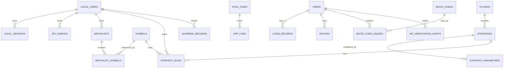

# Database Design

## 1. Storage Strategy

The system uses three storage layers.

Local SQLite:

- Structured application metadata.
- User session metadata.
- API configuration metadata.
- Watchlists.
- Strategy definitions and user parameters.
- Plugin installation records.
- Learning progress.
- Logs and sync status indexes.

Local DuckDB:

- Historical OHLCV bars.
- Backtest input tables.
- Backtest result series.
- Strategy metrics snapshots.
- Analytical queries over time-series data.

Cloud Postgres:

- User accounts.
- Invite codes.
- Email verification.
- Login records.
- Device records.
- Subscription or entitlement records.
- API verification audit.

## 2. Local SQLite Entities

### local_users

Purpose: local representation of the authenticated user.

Fields:

- id
- cloud_user_id
- email
- display_name
- session_status
- last_login_at
- created_at
- updated_at

### local_sessions

Purpose: local session and refresh metadata.

Fields:

- id
- user_id
- access_token_ref
- refresh_token_ref
- expires_at
- created_at
- updated_at

### api_configs

Purpose: LongPort and future broker API binding metadata.

Fields:

- id
- user_id
- provider
- api_url
- key_ref
- secret_ref
- status
- verified_at
- last_error_code
- created_at
- updated_at

Secrets are stored outside plain SQLite where possible. SQLite stores references and non-sensitive metadata.

### watchlists

Fields:

- id
- user_id
- name
- source
- sort_order
- created_at
- updated_at

### watchlist_symbols

Fields:

- id
- watchlist_id
- symbol_id
- sort_order
- added_at

### symbols

Fields:

- id
- provider
- market
- symbol
- exchange
- currency
- name
- lot_size
- price_tick
- timezone
- status
- created_at
- updated_at

### strategies

Fields:

- id
- strategy_key
- name
- source_type
- source_path
- version
- status
- description
- created_at
- updated_at

source_type values:

- preset
- plugin
- user

### strategy_parameters

Fields:

- id
- strategy_id
- user_id
- profile_name
- parameter_json
- created_at
- updated_at

### strategy_runs

Fields:

- id
- strategy_id
- user_id
- symbol_id
- timeframe
- mode
- status
- started_at
- ended_at
- parameter_snapshot_json
- result_summary_json

mode values:

- backtest
- realtime
- replay

### plugins

Fields:

- id
- plugin_key
- name
- version
- package_path
- status
- permissions_json
- installed_at
- updated_at

### learning_records

Fields:

- id
- user_id
- content_key
- content_type
- progress
- completed_at
- notes
- created_at
- updated_at

### sync_tasks

Fields:

- id
- task_type
- provider
- status
- cursor_json
- last_error_code
- last_error_message
- started_at
- finished_at
- created_at
- updated_at

### app_logs

Fields:

- id
- level
- category
- message
- context_json
- created_at

Logs must be redacted before persistence.

## 3. Local DuckDB Tables

### market_bars

Purpose: historical OHLCV cache.

Fields:

- provider
- market
- symbol
- timeframe
- adjustment
- timestamp
- open
- high
- low
- close
- volume
- turnover
- source_version

Recommended primary query key:

- provider
- symbol
- timeframe
- adjustment
- timestamp

### backtest_bars

Purpose: optional materialized datasets for reproducible backtests.

Fields:

- run_id
- timestamp
- open
- high
- low
- close
- volume

### backtest_events

Fields:

- run_id
- timestamp
- event_type
- side
- price
- quantity
- metadata_json

### strategy_metric_series

Fields:

- run_id
- timestamp
- metric_key
- metric_value

## 4. Cloud Postgres Entities

### users

Fields:

- id
- email
- password_hash
- status
- email_verified_at
- created_at
- updated_at

### invite_codes

Fields:

- id
- code_hash
- status
- max_uses
- used_count
- expires_at
- created_by
- created_at

### invite_code_usages

Fields:

- id
- invite_code_id
- user_id
- used_at
- device_fingerprint

### email_verifications

Fields:

- id
- email
- code_hash
- purpose
- expires_at
- verified_at
- created_at

### login_records

Fields:

- id
- user_id
- device_id
- ip_address
- user_agent
- status
- created_at

### devices

Fields:

- id
- user_id
- device_name
- device_fingerprint
- last_seen_at
- created_at

### api_verification_audits

Fields:

- id
- user_id
- provider
- status
- error_code
- created_at

No API secrets should be stored in cloud tables unless a future product requirement explicitly requires secure cloud vaulting.

## 5. ER Diagram

## 6. Data Retention

Suggested defaults:

- App logs: keep recent logs locally, archive older logs to files.
- Historical bars: keep until user clears cache.
- Backtest results: keep user-selected results; temporary runs can be pruned.
- Sync task history: retain recent records for diagnostics.
- Learning records: keep indefinitely unless user deletes account data.

## 7. Migration Policy

- Use explicit migrations from the first implementation.
- Never mutate historical K-line schemas casually.
- Keep schema version records.
- Migrations must be reversible during early development when practical.
