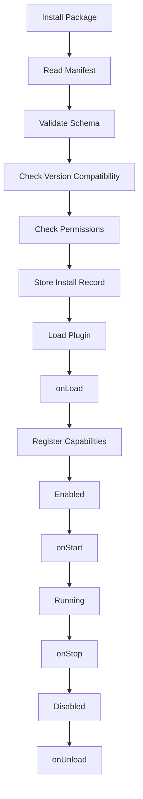
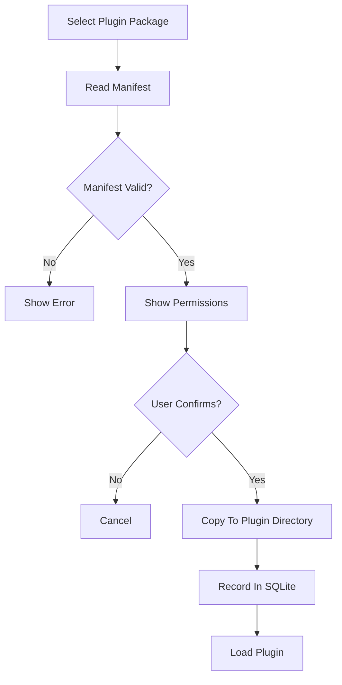

# Plugin System Design

## 1. Goals

The plugin system must allow future expansion without changing core modules.

Supported plugin types:

- Strategy plugins.
- Indicator plugins.
- Data source plugins.
- Export plugins.

The plugin system should support:

- Manifest-based installation.
- Version checks.
- Permission declarations.
- Lifecycle hooks.
- Capability registration.
- Disable/uninstall.
- Future hot update support.

## 2. Plugin Package Shape

```text
my-plugin/
  plugin.json
  dist/
    index.js
  README.md
```

## 3. Manifest

Example manifest shape:

```json
{
  "id": "com.example.strategy.orb-extension",
  "name": "ORB Extension Strategy",
  "version": "1.0.0",
  "type": "strategy",
  "main": "dist/index.js",
  "engine": {
    "app": ">=0.1.0",
    "pluginApi": ">=0.1.0"
  },
  "permissions": [
    "market-data:read",
    "strategy:run",
    "file:export"
  ],
  "capabilities": [
    "strategy"
  ]
}
```

## 4. Plugin Types

### Strategy Plugin

Provides:

- Strategy definition.
- Parameter schema.
- Runtime function.
- Optional educational notes.
- Optional default chart overlays.

### Indicator Plugin

Provides:

- Indicator definition.
- Parameter schema.
- Time-series calculation.
- Overlay or separate pane rendering data.

### Data Source Plugin

Provides:

- Symbol search.
- Historical bars.
- Realtime subscriptions.
- Provider health checks.

### Export Plugin

Provides:

- Export format.
- Export command.
- Optional target settings.

Examples:

- CSV exporter.
- JSON exporter.
- Backtest report exporter.

## 5. Lifecycle



Lifecycle hooks:

- onLoad
- onStart
- onStop
- onUnload
- onUpdate

## 6. Plugin API

Initial API surface:

```text
PluginContext
  - logger
  - registerStrategy()
  - registerIndicator()
  - registerDataSource()
  - registerExporter()
  - getPluginStorage()
  - getPermissions()
```

The plugin API should expose capabilities, not internal app objects.

## 7. Permissions

Suggested permissions:

- market-data:read
- market-data:subscribe
- strategy:run
- strategy:backtest
- chart:overlay
- file:read
- file:write
- network:request
- settings:read

Permission rules:

- Plugins must declare permissions in manifest.
- Permission changes require user confirmation.
- Unknown permissions block installation.
- Sensitive permissions should be visible in UI.

## 8. Isolation Strategy

Current implementation:

- Install and manage trusted local plugins only.
- Runtime source delivery to the renderer is blocked.
- Third-party strategy, indicator, data-source, and export execution are disabled under [ADR-002](./decisions/002-disable-third-party-plugin-execution.md). The former Node `vm` plus Utility Process design in ADR-001 was not a hostile-code boundary because host-realm constructors could recover Node capabilities.
- Both the main-process runtime host and the dormant Utility Process entry fail closed without reading or evaluating installed source. The production build no longer emits a plugin Utility Process executable entry.
- Install, schema/version/permission validation, list, enable/disable, failure recording, and uninstall remain available while execution is disabled. “Enabled” records management intent only and does not authorize execution.

Future implementation:

- Signature verification.
- Plugin store or curated registry.
- Permission consent history and audited updates.
- Dedicated asynchronous indicator, data-source, and export-plugin hosts.
- A genuinely no-Node strategy sandbox with an explicit capability protocol, resource limits, and adversarial escape tests.

Execution cannot be reopened by completing only one item above. Every
reconsideration condition in ADR-002 must pass an independent security review,
and reopening requires a new ADR.

## 9. Versioning

Version fields:

- plugin version
- required app version
- required plugin API version

Compatibility policy:

- Patch upgrades should be compatible.
- Minor upgrades can add optional capabilities.
- Major upgrades can break plugin API.

## 10. Installation

Install flow:



## 11. Hot Update Plan

Initial version:

- No automatic hot update.
- Allow manual install of a newer version.
- Disable old version before loading new version.

Future:

- Plugin registry metadata.
- Update check.
- Download package.
- Verify signature.
- Install side-by-side.
- Switch active version after restart or controlled reload.

## 12. Failure Handling

Plugin failures should not crash the app.

Failure behavior:

- Runtime error: log and mark plugin degraded.
- Repeated error: auto-disable plugin.
- Manifest error: block installation.
- Capability registration error: disable affected capability.

## 13. Built-In Strategies As Internal Plugins

Built-in preset strategies should follow the same capability model as plugins.

Initial built-ins:

- Ultimate Opening Range Breakout.
- Trend Targets.

This keeps future user and plugin strategies consistent with built-in strategies.

## 14. MVP Implementation Status (2026-07-15)

Implemented now:

- Electron main-process installation copies a selected local directory into the managed application plugin directory.
- `plugin.json` schema, package path, JavaScript entry path, supported permissions/capabilities, and app/plugin API versions are checked before install.
- Strategy and indicator manifests can be installed and managed. Data-source and export packages remain declared future capabilities and are rejected by the current runtime.
- The preload bridge exposes list, install, enable/disable, uninstall, source-free runtime snapshots, and strategy-run requests. Strategy-run requests fail closed with a fixed unavailable message and never read installed source.
- Existing runtime failure records and automatic-disable logic record blocked execution attempts without evaluating plugin code.
- Indicator manifests can still be installed and managed, but their execution is intentionally rejected until the indicator render protocol is isolated.
- `npm run smoke:plugin-runtime` builds the Electron application, asks the real production host to refresh and run a fixture strategy, and passes only when no strategy is registered and execution is rejected without reading fixture source or starting a plugin process.

Deliberate MVP limits:

- There is currently no third-party strategy execution boundary. Execution must remain disabled until a no-Node sandbox, signing, user consent history, and adversarial isolation tests are in place.
- No automatic hot update, remote download, indicator/data-source/export runtime host, or plugin-specific persistence API is provided yet.
