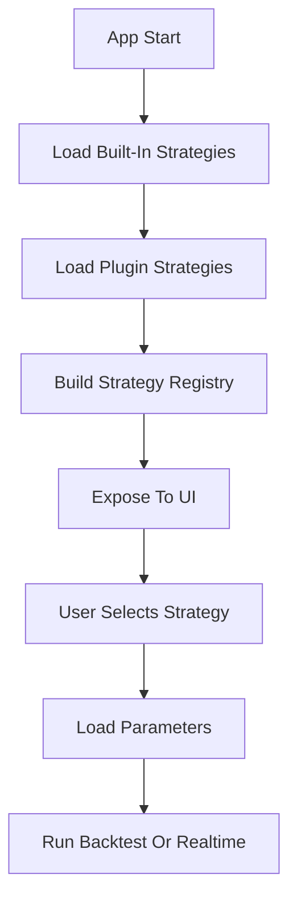
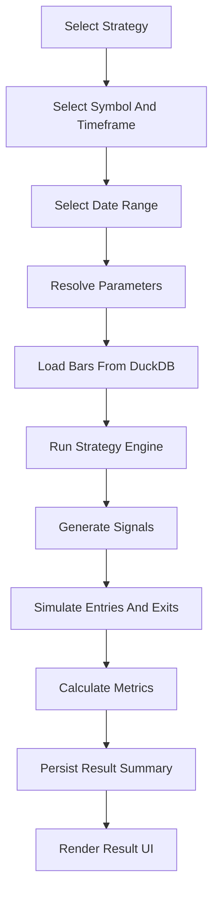
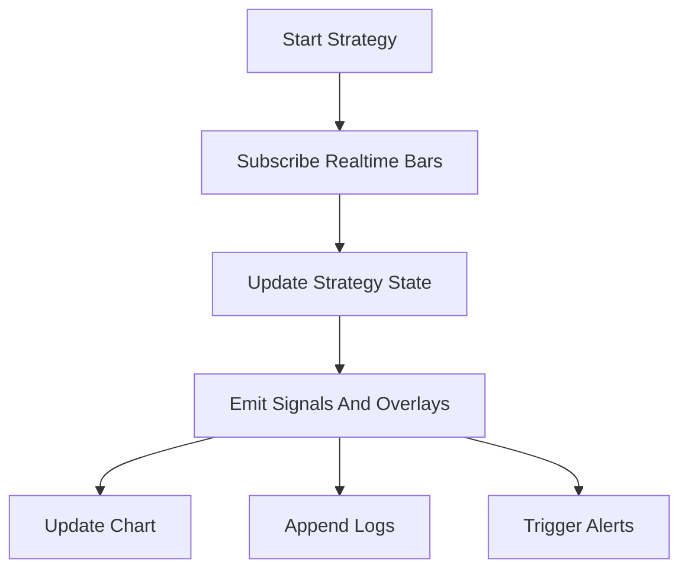

# Strategy System Design

## 1. Goals

The strategy system must be independent, testable, and extensible.

It should support:

- Built-in preset strategies.
- User-created strategies.
- Plugin-provided strategies.
- Historical backtesting.
- Realtime bar-by-bar execution.
- Parameter configuration.
- Strategy logs.
- Strategy result metrics.
- Chart overlays.

The first two built-in strategies are converted from Pine Script source files:

- `trading-strategies/utorb.md`
- `trading-strategies/trend-targets.md`

## 2. Key Principle

Strategies must not depend on:

- React.
- Electron.
- Chart library internals.
- LongPort SDK.
- Database implementations.

Strategies consume normalized market data and produce normalized outputs.

## 3. Strategy Package Layout

Planned packages:

```text
packages/
  strategy-engine/
    # Strategy contracts and runtime.
  preset-strategies/
    # Built-in strategy implementations.
  pine-runtime/
    # Pine-compatible helper functions.
```

## 4. Strategy Definition

Conceptual contract:

```text
StrategyDefinition
  - key
  - name
  - version
  - description
  - sourceType
  - parameterSchema
  - supportedMarkets
  - supportedTimeframes
  - run()
```

sourceType values:

- preset
- user
- plugin

## 5. Strategy Input

```text
StrategyInput
  - symbol
  - market
  - timeframe
  - bars
  - parameters
  - session
  - runMode
```

Bar shape:

```text
Bar
  - timestamp
  - open
  - high
  - low
  - close
  - volume
  - turnover
```

## 6. Strategy Output

```text
StrategyOutput
  - signals
  - overlays
  - render
  - metrics
  - logs
  - alerts
```

Signal examples:

- long_breakout
- short_breakout
- trend_flip_long
- trend_flip_short
- target_touched
- stop_touched

Overlay examples:

- line
- horizontal_level
- band
- label
- region
- volume_profile

### Strategy Visualization Layer

Strategies must not call chart APIs directly. A strategy should emit declarative visualization data, and the chart renderer decides how to draw it.

```text
StrategyRenderOutput
  - strategyId
  - strategyName
  - enabled
  - zIndex
  - elements
```

Supported visual element types:

- `SignalMarker`: buy/sell/alert arrows.
- `PriceLine`: stop loss, take profit, opening range, support/resistance.
- `TrendLine`: strategy-generated trend or moving guide lines.
- `Band`: opening range, risk zone, target zone.
- `Label`: compact strategy notes.

Layering rules:

- Each strategy owns one render layer by `strategyId`.
- Enabling or disabling a strategy toggles the whole layer.
- Parameter changes recompute the strategy output and replace that layer.
- Multiple strategies can be rendered at the same time by sorting `zIndex`.
- Chart packages consume `StrategyRenderOutput[]`, not strategy internals.

Metric examples:

- win_rate
- target_hit_rate
- max_drawdown
- net_pnl
- profit_factor

## 7. Pine Runtime Compatibility

The first implementation should not build a full Pine Script compiler.

Recommended route:

1. Manually translate initial Pine strategies to TypeScript.
2. Build a small Pine-compatible runtime for recurring functions.
3. Add a Pine subset compiler only if strategy volume justifies it.

Initial Pine helper functions:

- nz
- sma
- ema
- wma
- atr
- cross
- crossover
- crossunder
- highest
- lowest
- historical indexing helper

### Pine Import And Translation Plan

User-imported Pine scripts enter the system through staged analysis:

1. **Preflight**
   - Detect Pine version.
   - Detect `indicator()`, `strategy()`, or `library()` declaration.
   - Extract script title, `overlay`, `input.*` drafts, plot counts, and alert counts.
   - Mark unsupported calls such as `strategy.entry`, `strategy.exit`, `strategy.order`, and `strategy.close`.

2. **Translation plan IR**
   - Build a non-executable intermediate representation.
   - The IR may include declaration metadata, input drafts, visual declarations, alert declarations, and unsupported calls.
   - This IR is safe to show in the UI because it does not execute user code.

3. **Manual or automatic translation**
   - `ready`: can become a user strategy draft and later enter Pine subset translation.
   - `manual-review`: contains supported metadata but includes behavior that needs human review.
   - `unsupported`: cannot become a runnable strategy without a separate implementation path.

Initial supported subset for plan extraction:

- `//@version=...`
- `indicator(...)`
- `strategy(...)`
- `input(...)` and `input.*(...)`
- `plot(...)`
- `plotshape(...)`
- `plotchar(...)`
- `plotbar(...)`
- `plotcandle(...)`
- `alertcondition(...)`

Explicitly deferred:

- Full Pine grammar parsing.
- Historical series semantics beyond helper functions.
- `strategy.entry/exit/order/close` execution semantics.
- Drawing object lifecycle such as `line.new`, `label.new`, and updates.
- `request.security` and multi-symbol data access.

## 8. Built-In Strategy 1: Ultimate Opening Range Breakout

Source:

- `trading-strategies/utorb.md`

Original type:

- Pine `indicator()`.

Core behavior:

- Calculate opening range high and low.
- Generate upward and downward extension levels.
- Detect bullish and bearish breakouts.
- Track target hit rates.
- Optionally render volume profile.
- Optionally render ATR trailing stop.
- Optionally run stop optimizer.

First implementation scope:

- Opening range high/low.
- Extension levels.
- Bullish and bearish breakout signals.
- Target hit rate metrics.
- Alert outputs.
- Basic chart overlays.

Deferred:

- Volume profile rendering.
- Stop optimizer.
- Advanced dashboard reproduction.

## 9. Built-In Strategy 2: Trend Targets

Source:

- `trading-strategies/trend-targets.md`

Original type:

- Pine `indicator()`.

Core behavior:

- Supertrend-derived upper and lower bands.
- WMA and EMA smoothed trend line.
- Trend direction changes.
- Rejection signals.
- Entry, stop loss, and three target levels.
- Alert outputs.

First implementation scope:

- Trend line.
- Trend flip signals.
- Rejection signals.
- Entry/SL/TP1/TP2/TP3 overlays.
- Alert outputs.

Required correction:

- The TypeScript version must explicitly guard line/label state updates. The original Pine drawing behavior can rely on TradingView object behavior, but the application runtime must not update missing overlay objects.

## 10. Strategy Registry



Registry responsibilities:

- Register built-in strategies.
- Register plugin strategies.
- Resolve strategy by key.
- Expose parameter schemas.
- Hide disabled or incompatible strategies.

## 11. Backtest Flow



## 12. Realtime Flow



## 13. Testing Strategy

Required tests when implementation begins:

- Pine runtime helper tests.
- Strategy parameter validation tests.
- Deterministic output tests for small OHLCV fixtures.
- Opening range boundary tests.
- Breakout detection tests.
- Trend flip detection tests.
- Stop and target level calculation tests.
- Regression tests for no missing overlay updates.

## 14. Acceptance Criteria

- Strategies run without launching the desktop shell.
- Same input bars and parameters produce stable output.
- Chart overlays are data objects, not direct chart API calls.
- New strategy modules can be added without changing chart, LongPort, or persistence core.
- Built-in strategies and plugin strategies use the same interface.
