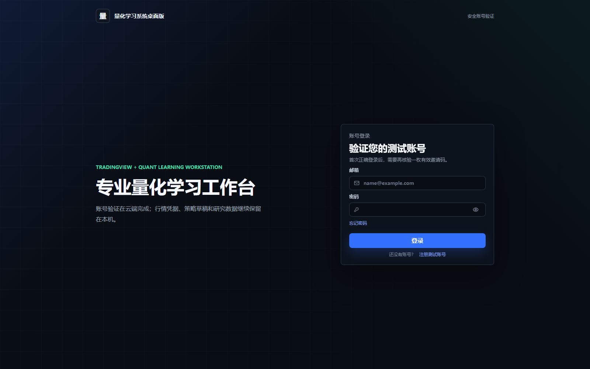
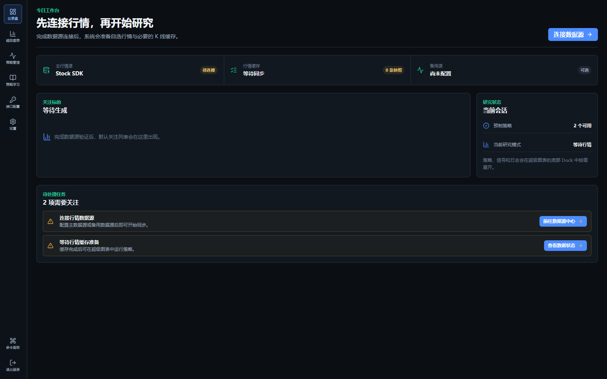
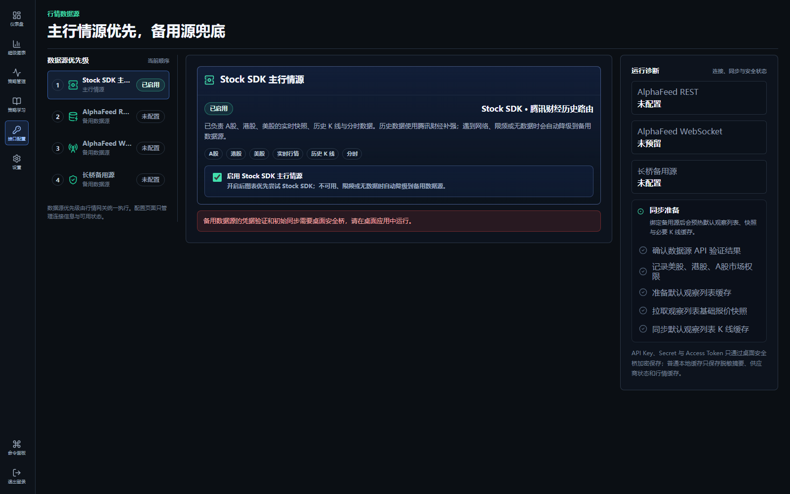
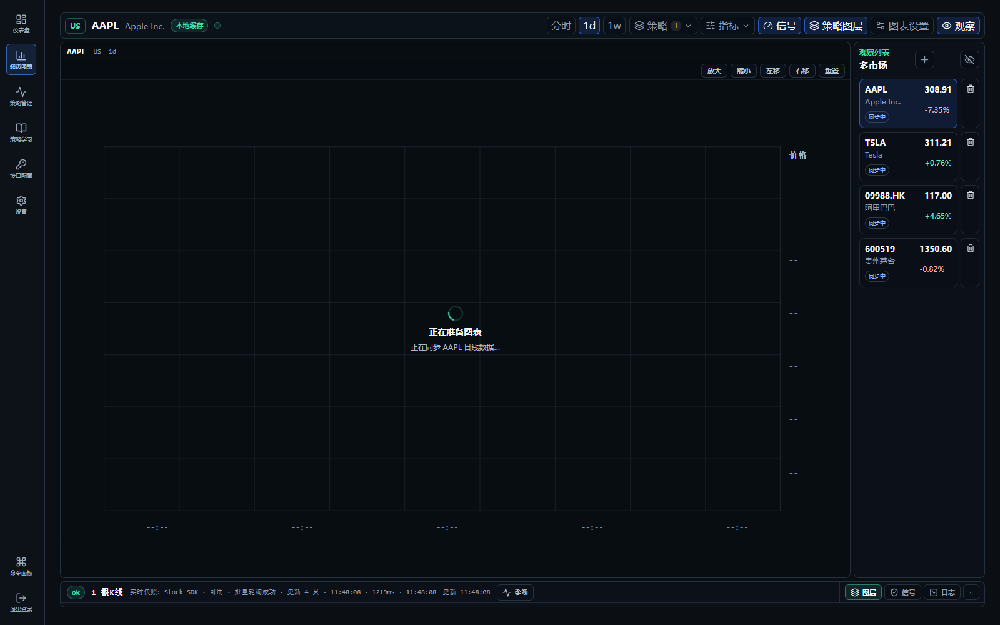
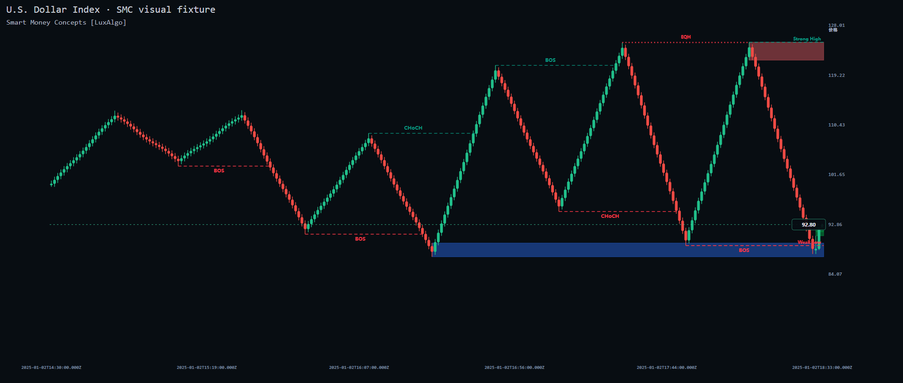
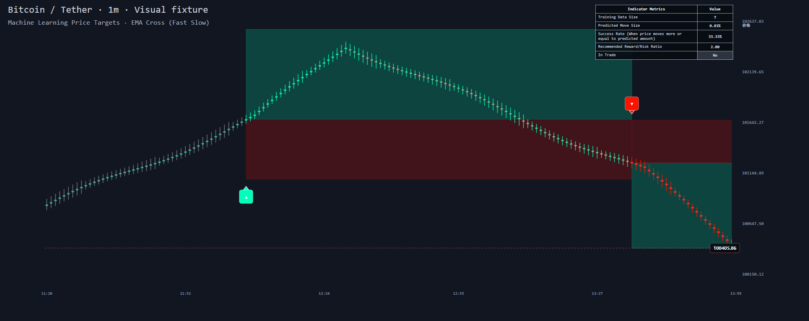
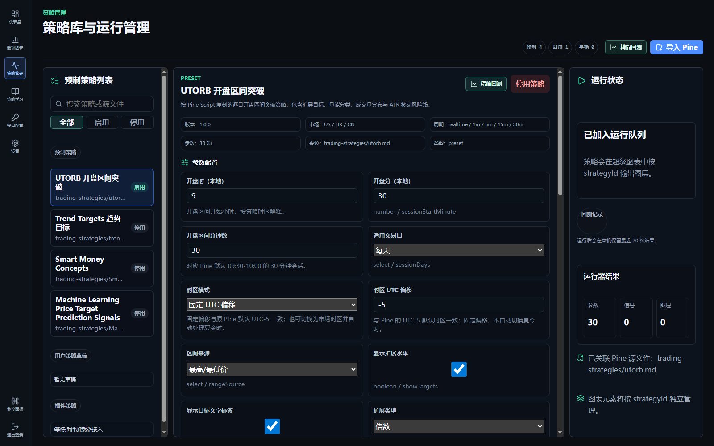
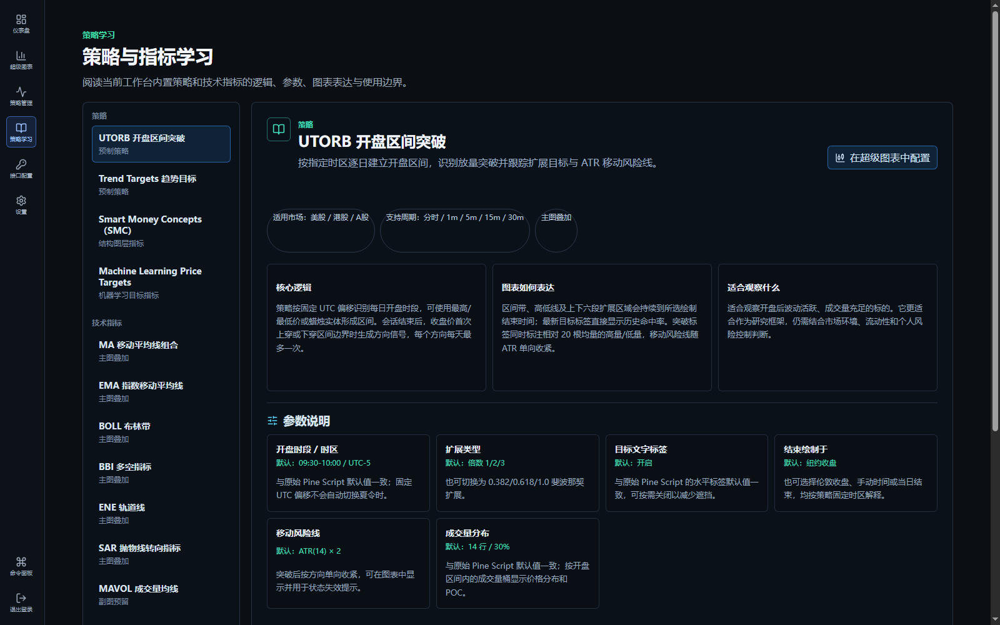
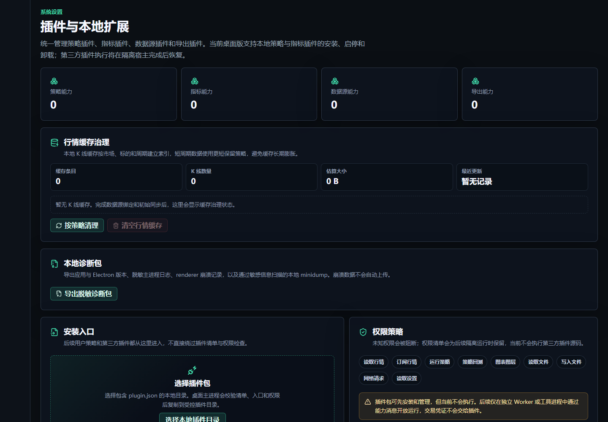

# 量化学习系统桌面版用户使用手册

> 适用版本：0.1.1 
> 更新日期：2026-08-01 
> 面向对象：首次接触本系统的学习者、策略研究者和行情图表用户

> 截图说明：截图来自当前版本的真实桌面渲染或项目视觉验证数据。行情价格、时间、同步状态和列表内容仅作界面说明，实际使用时会随账号、数据源和市场变化。

## 1. 系统是什么

量化学习系统桌面版是一套本地优先的行情观察、图表研究、策略学习和历史回测工作台。它可以帮助您：

- 查看美股、港股和 A 股行情与 K 线；
- 在超级图表中添加技术指标、策略图层和手动画线；
- 阅读内置策略的原理、参数、图表输出与风险提示；
- 使用本地已缓存行情运行精简回测；
- 保存 Pine Script 策略草稿并进行兼容性预检；
- 管理本地行情缓存、诊断包和插件清单。

本系统用于学习与研究，不提供实盘下单功能。图表条件事件、观察水平、结构区域和历史模拟结果均不构成投资建议。

## 2. 开始前须知

### 2.1 数据与账号分别存放

- 账号验证和测试资格由云端服务完成。
- 行情缓存、策略草稿、画线和研究偏好主要保存在本机。
- 普通退出登录不会删除本机研究资料。
- 同一 Windows 用户切换到另一个量化账号时，系统会要求确认清除原账号的本机资料。该操作不可撤销，请先确认重要内容已经备份。

### 2.2 网络与离线使用

- 注册、邀请码验证、首次登录和资格续期需要网络连接。
- 已建立有效会话后，系统可能进入“离线授权”状态，并在顶部显示可用截止时间。
- 离线授权即将到期时，请连接网络并点击“立即重新验证”。
- 实时行情、证券搜索和缺失历史数据的补充仍依赖可用的数据源与网络。

### 2.3 当前能力边界

- 工作台当前直接提供“分时、1d、1w”三个周期入口；策略不支持当前周期时会显示“周期不支持”。
- 用户导入的 Pine Script 当前主要用于预检、保存草稿和转译准备，不应理解为完整 Pine 编译器，也不会直接执行任意用户代码。
- 第三方插件可进行清单校验、安装、启停和卸载，但第三方源码执行目前暂停。
- Smart Money Concepts 和 Machine Learning Price Targets 属于指标型研究工具，不生成回测交易或收益率。

## 3. 第一次使用：推荐流程

建议新用户按以下顺序操作：

1. 打开桌面应用，注册或登录账号。
2. 首次登录后按提示输入有效邀请码，激活测试资格。
3. 进入“接口配置”，确认 Stock SDK 主行情源已启用；有备用数据服务时再配置 AlphaFeed 或长桥凭据。
4. 回到“仪表盘”，确认行情和研究状态可用。
5. 进入“超级图表”，选择标的和周期，先观察基础 K 线。
6. 打开“策略学习”，阅读目标策略的逻辑、参数和风险提示。
7. 回到“超级图表”，开启策略并逐项调整参数。
8. 观察底部面板中的“图层、信号、日志”，确认策略是否真正运行。
9. 在所需标的与周期已形成本地行情缓存后，前往“策略管理”运行精简回测。

## 4. 注册、登录与测试资格

_图 1：账号登录页面。首次正确登录后还需按提示验证邀请码。_

### 4.1 注册账号

1. 在登录页点击“注册测试账号”。
2. 输入邮箱并获取邮箱验证码。
3. 输入验证码并设置密码。
4. 密码需为 8–64 位，包含大写字母、小写字母、数字和特殊符号，并且不能包含空格或非 ASCII 字符。
5. 提交注册。若邮箱已经注册，系统会引导您返回登录。

邮箱验证码有有效期；按钮进入倒计时后，请勿连续重复请求。

### 4.2 登录与邀请码

1. 输入注册邮箱和密码。
2. 首次正确登录后，系统会要求验证邀请码。
3. 输入有效邀请码后，测试资格生效，页面会显示资格截止日期。

若资格已经过期，可在登录流程中重新输入邀请码，也可以在“设置”页提前续期。

### 4.3 忘记密码

点击“忘记密码”，按页面提示获取邮箱验证码并设置新密码。新密码仍需满足全部安全规则。

### 4.4 退出登录

侧边栏底部提供“退出登录”。系统会先显示确认对话框。退出只结束当前账号会话，不会自动清除本地行情缓存、画线和策略草稿。

## 5. 工作区导航

登录后，左侧主导航包含：

| 页面     | 主要用途                                         |
| -------- | ------------------------------------------------ |
| 仪表盘   | 查看行情连接、观察列表、研究状态和待处理任务     |
| 超级图表 | 查看行情、指标、策略图层、信号、日志和画线       |
| 策略管理 | 管理预制策略与 Pine 草稿，配置参数并运行精简回测 |
| 策略学习 | 阅读策略及技术指标的原理、参数和使用边界         |
| 接口配置 | 管理主行情源与备用数据源，查看同步和连接诊断     |
| 设置     | 管理资格、本地缓存、诊断包和插件                 |

按 `Ctrl+K` 可打开命令面板。输入页面名称后按回车，可快速跳转；按 `Esc` 关闭面板。

## 6. 仪表盘

仪表盘是每日开始研究的状态页，重点关注三块信息：

_图 2：尚未完成行情连接时的仪表盘。右上角主按钮和待处理任务会引导用户进入数据源配置。_

- “市场数据状态”：判断数据源是否可用、是否已经完成必要同步；
- “关注标的”：显示观察列表及已经获取的实时快照数量；
- “待处理任务”：提示尚未配置或需要修复的数据源问题。

如果页面显示“先连接行情，再开始研究”，点击主按钮进入“接口配置”。如果显示“行情与研究已就绪”，可直接进入超级图表。

## 7. 接口配置

_图 3：接口配置总览。左侧选择数据源，中间管理当前来源，右侧查看连接与同步状态。截图未展示任何真实凭据。_

### 7.1 数据源优先级

当前系统通过统一行情网关选择数据源：

1. Stock SDK：主行情源，负责实时快照和证券搜索，历史 K 线由腾讯财经路由补充；
2. AlphaFeed REST：备用实时快照和 K 线轮询源，也可承担绑定后的初始同步；
3. AlphaFeed WebSocket：购买相应服务后使用的流式备用通道；
4. 长桥：历史 K 线、分时回补和未来券商接口的备用源。

当优先数据源不可用、限频或没有数据时，网关会尝试兼容的备用源。图表和策略读取统一后的行情，不直接绑定某一家供应商。

### 7.2 配置方法

- Stock SDK：确认“启用 Stock SDK 主行情源”处于开启状态，无需填写用户凭据。
- AlphaFeed REST：填写 API URL 和 API Key，点击“验证并保存备用数据源”。
- AlphaFeed WebSocket：填写 WebSocket URL、API Key，并选择“仅关注列表”或“全标的流”，然后保存。
- 长桥：填写 API URL、App Key、API Secret 和 Access Token，验证后保存。

API Key、Secret 和 Access Token 只通过桌面安全桥加密保存；普通本地缓存只保存脱敏摘要和供应商状态。请勿在截图、日志或策略说明中粘贴完整凭据。

### 7.3 如何判断配置成功

查看右侧“运行诊断”：

- 供应商状态应显示已启用、已配置或健康；
- “同步准备”的观察列表、快照和 K 线缓存步骤应逐步完成；
- 若出现未授权、限频或网络错误，先检查凭据、网络和服务额度，再重试。

## 8. 超级图表

_图 4：超级图表在同步行情时的布局。顶部管理周期与研究工具，右侧为观察列表，底部为图层、信号和日志。数据完成同步后，中间区域显示价格图表。_

### 8.1 选择和管理标的

右侧“观察列表”默认包含多个市场的示例标的。点击某一行即可切换当前图表。

添加标的：

1. 点击观察列表标题旁的“+”。
2. 输入证券代码、名称或拼音。
3. 点击“搜索”。
4. 在结果中选择添加。

删除标的时点击行尾删除按钮。观察列表至少保留一个标的。点击右侧折叠按钮或顶部“观察”可隐藏/展开列表。

### 8.2 选择周期和图表形态

顶部周期栏当前提供：

- “分时”：分钟级实时研究；可切换“折线”或“K线”；
- `1d`：日线；
- `1w`：周线。

切换标的或周期后，系统会重新读取本地缓存并按需补充数据，策略也会基于新上下文重新计算。顶部状态栏中的“本地缓存”“等待数据”和供应商健康信息可帮助判断数据是否就绪。

### 8.3 缩放、定位与右键菜单

- 使用鼠标在图表中进行平移、缩放和十字光标观察。
- 左侧工具栏的“回到最新数据”可快速返回最近 K 线。
- “锁定价格比例”用于避免纵轴比例意外变化。
- 在图表区域右键，可打开“重置视图、图表设置、显示/隐藏策略图层、显示/隐藏当前价线”等快捷操作。

### 8.4 图表设置

点击顶部或左侧的“图表设置”，可调整：

- 网格；
- 十字光标；
- 价格标签；
- 当前价线；
- 分时图表形态；
- 实时行情刷新频率；
- 重置视图。

刷新越频繁，对数据源额度和网络稳定性的要求越高。出现限频时应适当降低刷新频率。

### 8.5 技术指标

点击顶部“指标”打开指标菜单。当前内置指标包括：

- 主图指标：MA、EMA、BOLL、BBI、ENE、SAR；
- 副图指标：MAVOL、VOL、MACD、KDJ、RSI、WR、CCI。

主图指标可同时启用多个；副图指标当前为单选。点击指标旁的参数入口可修改周期等参数。指标需要足够的历史 K 线完成预热，数据不足时前段可能没有线条。

### 8.6 画线工具

左侧工具栏支持：

- 趋势线：依次在图表中选择两个点；
- 水平线：选择一个价格位置；
- 文字标注：在目标位置添加说明；
- 取消当前工具；
- 撤销与重做；
- 清空当前标的、当前周期的全部绘图。

绘图会绑定当前标的和周期。可在底部“图层”页签中显示、隐藏、编辑、排序或删除单个绘图。

### 8.7 底部面板

底部面板可展开或收起，包含三个页签：

- “图层”：管理策略、指标和绘图的启用、可见性、参数及前后层级；
- “信号”：查看当前标的和周期产生的信号，点击一条信号可查看方向、价格、时间、参数和最近日志；
- “日志”：查看策略运行、预热、提醒和异常信息。

“启用策略”和“显示策略图层”含义不同：前者决定是否计算策略，后者只控制结果是否绘制。策略已启用但图层隐藏时，底部状态会显示“已隐藏”。

## 9. 如何在图表中使用策略

1. 先选择标的和周期。
2. 点击顶部“策略”。
3. 在列表中点击“打开”，启用目标策略。
4. 点击“参数”，检查或修改参数。
5. 确认顶部“策略图层”和“信号”按钮已开启。
6. 展开底部“图层”，检查策略状态：
   - “运行中”：策略已完成计算并有可见输出；
   - “预热中”：历史 K 线数量不足，请等待或补充缓存；
   - “ATR 预热中”：波动率窗口尚未完成；
   - “周期不支持”：切换到策略支持的周期；
   - “无数据”：当前标的或周期没有可用 K 线；
   - “无图层”：策略已运行，但当前条件下没有可绘制内容；
   - “已隐藏/已停用”：检查图层开关或策略开关。
7. 在“信号”和“日志”中交叉确认，不要只根据图上的单个箭头做判断。

参数修改会触发策略重新计算。建议每次只修改一组参数，并记录标的、周期、样本区间和修改值，便于比较结果。

## 10. 策略解释

### 10.1 先理解几个共同概念

- ATR：平均真实波幅，用来衡量波动大小，不表示方向。
- R：从条件触发参考价到风险线的距离。`1R` 观察水平表示与初始风险距离相同的模型测算距离。
- BOS：Break of Structure，价格沿既有结构方向突破已确认枢轴。
- CHoCH：Change of Character，突破方向与此前结构趋势相反，提示结构可能发生变化。
- 订单块：结构突破前的来源蜡烛所代表的候选供需区域，不等同于必然支撑或阻力。
- FVG：Fair Value Gap，三根 K 线形成的价格失衡区；价格可能回补，也可能长期不回补。
- 预热：指标需要一定数量的历史 K 线才能计算完整窗口。预热完成前没有信号是正常现象。
- 确认 K 线：策略仅使用已经收盘的数据确认信号，可降低盘中信号反复出现和消失的问题，但信号会相对滞后。

### 10.2 UTORB 开盘区间突破

适合周期：当前工作台主要在“分时”使用。策略引擎还支持 1m、5m、15m、30m。

核心逻辑：

1. 按指定时区和开盘时段，记录一段时间内的最高价与最低价，形成每日开盘区间。
2. 会话结束后，收盘价首次上穿区间上沿时产生向上突破信号，首次下穿区间下沿时产生向下突破信号。
3. 每个方向每天最多产生一次首次突破信号。
4. 策略按区间宽度计算三档向上和三档向下扩展目标，并可按成交量区分高量或低量突破。
5. 可选 ATR 移动风险线只沿有利方向收紧，用于观察趋势是否失效。

重点参数：

- 开盘时段与时区：默认 09:30–10:00、UTC-5；也可选择跟随市场时区以自动处理夏令时。
- 区间来源：可使用完整最高/最低价或蜡烛实体。
- 扩展类型：倍数模式默认 1、2、3，也可切换为斐波那契扩展。
- 成交量分布：默认 14 行、30% 宽度，用于显示区间内的量价分布和 POC。
- 移动风险线：默认 ATR(14)×2，但图层默认关闭，需要手动开启。

如何阅读：突破标签说明方向与相对量能；区间外目标只表示按区间宽度推算的位置；历史命中率描述样本内的过去结果，不代表未来概率。

主要风险：假突破、开盘跳空、低流动性和市场开盘时间设置错误都会显著影响结果。A 股、港股和美股不应机械共用同一时区参数。

### 10.3 Trend Targets 趋势目标

适合周期：当前工作台可在“分时”和 `1d` 使用；策略引擎还支持 15m、30m、1h。

核心逻辑：

1. 使用 Wilder ATR 构造递推收紧的 Supertrend 上下轨。
2. 取轨道中点，先做 WMA，再做 EMA 双重平滑，得到趋势基准线。
3. 平滑线斜率由负转正时识别上行趋势，由正转负时识别下行趋势。
4. K 线连续穿越当前趋势基准线超过确认次数后，显示拒绝标记。
5. 趋势转变时按当根 ATR 固定条件触发参考、风险线和三档观察水平。

重点参数：

- Supertrend 因子 12、ATR 周期 90：数值越大，轨道通常越宽或越平滑，信号更慢。
- WMA 40、EMA 14：周期越长，趋势线越平滑，但拐点确认越晚。
- 拒绝确认 3：数值越高，标记更少但确认更严格。
- 风险线 ATR×5；目标默认 0.5R、1R、1.5R。

如何阅读：绿色/红色分段表示当前趋势状态，趋势转变箭头是方向变化提示，拒绝标记表示价格多次穿越后未能延续。目标线是基于信号时波动率的固定投影，不会保证触达。

主要风险：趋势指标天然滞后；横盘行情容易反复翻转，突发消息和跳空可能直接越过风险线。

### 10.4 Smart Money Concepts（SMC）

适合周期：分时、`1d`、`1w`。该工具属于结构图层指标，不生成回测 PnL。

_图 5：SMC 视觉验证示例。虚线标签表示结构事件，半透明区域表示候选订单块；该图用于解释图层，不代表实时行情。_

核心逻辑：

- 内部结构观察较短波段，摆动结构识别更高层级方向。
- 价格突破已确认枢轴时绘制 BOS；与此前结构趋势反向时绘制 CHoCH。
- HH、HL、LH、LL 描述高低点序列；Strong/Weak High/Low 描述当前结构下更可能被保护或被测试的一侧。
- 订单块从结构突破前的来源蜡烛提取，并在价格失效后从有效图层移除。
- EQH/EQL 连接接近的已确认高点或低点，用于观察潜在流动性区域。
- FVG 描述三根 K 线形成的失衡，回补后会从当前有效图层移除。
- Premium、Equilibrium、Discount 表示价格在当前摆动区间的相对位置。

重点参数：

- Historical 保留受对象上限约束的历史结构；Present 只显示各类别最近的有效对象。
- 摆动枢轴长度默认 50；更大数值更偏向高层级结构，也更滞后。
- 订单块过滤默认 ATR(200)，至少需要 200 根 K 线完成 ATR 预热。
- EQH/EQL 默认长度 3、阈值 0.1；阈值越小，认定“接近”的条件越严格。
- FVG、前日/周/月高低点和趋势蜡烛默认关闭，需要时再开启，避免图表过密。

如何阅读：先用摆动结构判断大方向，再用内部结构观察细节；BOS/CHoCH、订单块、FVG 和流动性区域应相互验证，不应把其中任何一个单独理解为交易行动指令。

主要风险：枢轴需要等待右侧 K 线确认，因此标记必然晚于极值；结构解释具有主观使用空间。当前实现用于本地非商业研究，相关源策略采用 CC BY-NC-SA 4.0，商业使用需另行确认授权。

### 10.5 Machine Learning Price Targets

适合周期：仅“分时”（实时 1 分钟）。该工具属于机器学习目标指标，不生成订单、收益率或回测 PnL。

_图 6：机器学习价格移动研究视觉验证示例。绿色和红色区域分别表达观察与风险范围，右上角表格显示模型统计；该图不构成价格预测承诺。_

核心逻辑：

1. 在每次趋势方向切换时，记录上一趋势段的最大有利移动。
2. 使用价格位置、波动变化、二阶变化、成交量振荡、震荡度、RSI 和趋势方向等 8 个特征描述样本。
3. RBF 核回归按当前特征与历史样本的距离分配权重，估计下一趋势段的移动比例。
4. 有效模型估计从确认 K 线收盘价绘制观察区和风险区，并显示方向箭头与统计表。

重点参数：

- 趋势模式：可选 EMA 50/200 交叉、HMA 93 斜率或 SuperTrend 3/10。
- RBF 带宽默认 5：影响较远历史样本参与模型估计的权重。
- 历史预热需要 1,000 根已确认分钟 K 线；不足时只显示预热进度。

如何阅读：统计表中的训练样本量、模型波动估计、历史条件达标率、模型测算比率和观察状态应一起判断。观察区是基于当前标的历史样本的估计，不代表模型知道未来价格。

主要风险：样本少、市场状态变化、异常成交量或数据缺口都会降低可靠性。信号在 K 线收盘后确认，因此不会随未收盘价格反复消失，但会晚于盘中首次穿越。

### 10.6 技术指标与策略的区别

- 技术指标主要描述趋势、波动、动量或成交量，本身通常不定义完整交易规则。
- 策略至少需要明确方向信号，才能进入精简回测。
- SMC 和 Machine Learning Price Targets 虽然位于预制策略注册表中，但产品定位是图层型指标，不应使用胜率或收益率来评价其单独表现。
- 多个指标同时出现相同方向，只代表基于不同计算方法得到了一致观察，不等于风险已经消失。

## 11. 策略管理

_图 7：策略管理页面。左侧选择策略，中间修改参数，右侧检查运行状态；顶部可进入精简回测或 Pine 草稿导入。_

### 11.1 管理预制策略

策略管理页左侧可按名称搜索，并用“全部、启用、停用”筛选。选择策略后，右侧显示：

- 版本、支持市场和周期；
- 参数配置；
- 当前样例信号与图层元素；
- 可视化输出协议和能力边界；
- 最近回测结果。

这里的启用状态会与策略研究配置关联。图表中的显示与层级管理仍建议在超级图表底部“图层”页签完成。

### 11.2 导入 Pine 策略草稿

1. 点击“导入 Pine”。
2. 粘贴 Pine Script 源码。
3. 查看声明类型、overlay 设置、输入参数、可视化声明、告警声明和不支持调用。
4. 只有预检允许时才能创建草稿。
5. 创建后可修改草稿名称、描述和参数默认值，也可复制或删除草稿。

当前预检不等同于编译或运行。页面显示“需人工复核”或“不支持调用”时，需要先调整源码；即使显示“待转译”，也不代表草稿已经接入图表或回测。

## 12. 精简回测

### 12.1 运行方法

1. 先在超级图表加载目标标的和策略支持的周期，使行情写入本地缓存。
2. 打开“策略管理”，选择能产生交易方向信号的策略。
3. 点击“精简回测”。
4. 选择行情缓存，确认市场、标的、周期和 K 线数量。
5. 设置初始资金、单边费率、单边滑点。
6. 按需开启“向下方向模拟”。关闭时，向下信号只用于结束向上方向模拟。
7. 点击“运行回测”。

回测只使用本地已缓存的标准化行情，不会在运行时自动请求新数据。列表为空时，请先回到超级图表加载相应标的和周期。

### 12.2 成交假设

- 信号在下一根 K 线开盘价模拟成交，避免使用信号当根尚未完成的信息。
- 费率和滑点按单边分别计算。
- 回测结束时仍有持仓，会按最后一根 K 线收盘价强制平仓。
- 当前为精简模型，不模拟盘口深度、部分成交、涨跌停无法成交、融资融券约束、税费差异或券商规则。

### 12.3 指标解释

| 指标     | 含义                                   | 阅读提醒                          |
| -------- | -------------------------------------- | --------------------------------- |
| 最终资金 | 初始资金加全部已实现净损益             | 已扣除模型中的费率与滑点          |
| 总收益率 | 相对初始资金的累计收益比例             | 不能反映收益过程是否平稳          |
| 最大回撤 | 权益曲线从历史峰值到后续低点的最大跌幅 | 越小通常越稳健，但需结合收益看    |
| 交易次数 | 完整开平仓交易数量                     | 样本过少时胜率没有统计意义        |
| 胜率     | 盈利交易数占总交易数的比例             | 高胜率也可能伴随单次巨亏          |
| 盈利因子 | 总盈利金额 ÷ 总亏损绝对值              | 大于 1 表示样本内总盈利高于总亏损 |

### 12.4 避免常见回测误区

- 不要只看收益率，应同时看回撤、交易数、盈利因子和单笔交易。
- 不要在同一段数据上反复调参后把最好结果当作未来表现，这可能是过拟合。
- 应加入符合真实市场的费率和滑点。
- 应分开使用训练区间和验证区间，并尝试不同市场状态。
- 数据缺口、复权口径和分钟线历史长度都会影响结果。

## 13. 策略学习

“策略学习”页面是理解策略的首选入口。左侧目录分为“策略”和“技术指标”，右侧展示：

_图 8：策略学习页面。建议先读核心逻辑和使用边界，再点击“在超级图表中配置”。_

- 核心逻辑或计算含义；
- 适用市场与支持周期；
- 参数默认值和影响；
- 图表输出；
- 使用边界与风险提示；
- 原始策略来源和许可证信息（如有）。

对带有“在超级图表中配置”按钮的条目，可直接跳转图表。跳转后仍需在顶部“策略”菜单中启用对应策略。

建议采用“先学习、再观察、后回测”的顺序，而不是看到信号后再寻找解释。

## 14. 设置、本地缓存与插件

_图 9：设置页面。可维护行情缓存、导出诊断包，并查看插件能力和权限策略。_

### 14.1 账号与资格

设置页可查看当前账号和测试资格，并输入新邀请码提前续期。退出登录前会显示确认对话框。

### 14.2 行情缓存

- “按策略清理”：按保留策略删除过旧数据和空缓存，适合日常维护；
- “清空全部”：删除全部本地行情缓存，之后图表需要重新请求数据；
- 缓存列表显示占用较大的标的与周期，便于定位空间使用。

清空缓存会影响离线图表和精简回测可用数据，执行前请确认确实需要重新同步。

### 14.3 本地诊断包

遇到无法定位的桌面问题时，可导出诊断包。诊断包包含应用/Electron 版本、脱敏日志和经过筛选的崩溃信息，不应包含完整行情凭据。提交给维护人员前仍建议检查文件内容。

### 14.4 插件

安装本地插件前，系统会读取 `plugin.json`，检查版本、能力和权限。未知权限会被阻断。当前第三方插件执行暂停，因此“已安装”或“已启用”不代表其策略/指标已经进入图表运行。

## 15. 常见问题排查

### 图表一直显示“等待数据”

1. 打开“接口配置”，检查主行情源是否启用。
2. 查看运行诊断是否显示未授权、网络错误或限频。
3. 检查证券代码与市场是否正确。
4. 切换到另一个周期或标的验证问题范围。
5. 降低轮询频率后重试。

### 策略已启用但图上没有内容

依次检查当前周期是否支持、K 线是否足够、顶部“策略图层”是否打开、该策略的“图层”开关是否打开，以及日志中是否有预热提示。某些策略在当前行情条件下确实可能没有信号或图层。

### Machine Learning Price Targets 一直预热

该指标要求至少 1,000 根已确认的实时分钟 K 线。保持在“分时”周期，并等待历史回补完成。日线或周线不能运行该指标。

### SMC 显示 ATR 预热中

默认订单块过滤使用 ATR(200)，至少需要 200 根 K 线。可以等待数据补齐；若研究目的允许，也可在参数中改用累计均幅过滤，但这会改变计算口径。

### 精简回测没有可选行情

先在超级图表中打开目标标的和策略支持的周期，等待缓存形成，再返回策略管理。回测不会主动联网补数据。

### 频繁出现限频

调低图表顶部的轮询频率，减少同时观察的标的，并检查数据服务套餐或额度。等待状态提示中的重试时间后再操作。

### 登录后提示本机绑定其他账号

这是本地资料隔离保护。选择取消可保留原账号本机资料；只有在确定无需保留或已经备份时，才选择清除资料并切换账号。

## 16. 推荐的研究习惯

每次研究建议记录以下信息：

- 标的、市场和周期；
- 数据区间与 K 线数量；
- 策略版本和完整参数；
- 是否开启向下方向模拟；
- 费率与滑点；
- 总收益率、最大回撤、交易数、胜率和盈利因子；
- 未被模型覆盖的真实交易约束；
- 对结果的解释，以及与预期不一致的地方。

一个可复用的研究流程是：

1. 在策略学习页明确策略试图描述的市场现象。
2. 在图表中观察信号形成前后的价格结构。
3. 检查日志和数据状态，排除预热或缺数。
4. 固定参数运行回测。
5. 更换时间区间或标的做样本外验证。
6. 只在结果具有稳定性时继续深入，而不是追逐单次最佳值。

## 17. 风险声明

本系统的策略、指标、历史模拟、机器学习估计、观察水平和条件事件提醒均为学习与研究工具。历史表现不代表未来结果。真实交易还会受到流动性、延迟、滑点、费用、复权、交易制度、停牌、涨跌停、公司行为和突发事件等影响。任何交易决定均应由用户独立判断并自行承担风险。
